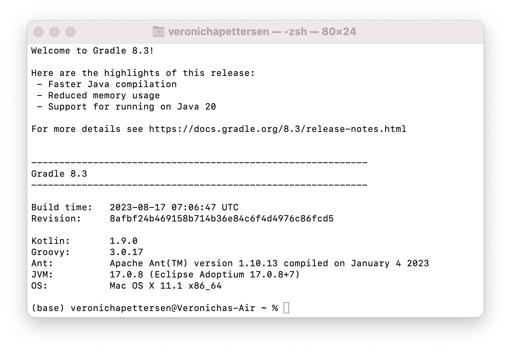

# Report DAT250: Software Technology Experiment Assignment 1
The goal of this assignment is to set up a working development enviroment in Java. 
This report documents the process of setting up and configuring the software development enviroment on my computer.
I'm currently working on Mac OS

## Getting the software development enviroment up and running 
Following the instrunctions provided, I installed the following programs:
 - Java Development Enviroment (JDK)
 - An Integrated Development Enviroment (IDE)
 - Gradle build tool
 - Git
 - Podman or Docker

### Java 
The first program I installed on my computer was [homebrew] (https://brew.sh/). This is a software package management system that simplifies installation of software on macOS and Linux. 
I then followed the [instructions provided](https://sdkman.io/install) to istall [SDKman](https://sdkman.io/)
```
$ curl -s "https://get.sdkman.io" | bash
```
```
$ source "$HOME/.sdkman/bin/sdkman-init.sh"
```
And verified that the installation was successuful:


I then installed the latest version of java with SDKman:
```
sdk install java
```

and verified that the version indeed was >= 11:


### IDE
I chose to download the [JetBrains IntelliJ IDE](https://www.jetbrains.com/idea/download/?section=mac).
The download was pretty straight forward, installing it from JetBrains pages. 
I let all settings be set to default. 

### Gradle
I installed Gradle via SKMman with the following command:
```
sdk install gradle 
```
and verified that it was workig by running 
```
gradle -v
```


### Git
I already have git installed om my computer:


### Containers
I installed podman on my machine, using homebrew:
```
brew install podman
```
and created an account on [DockerHub](https://hub.docker.com/)

And with that, I now have all the requiered tools up and running on my machine.


## The Exercise
The purpose of this part of the assignment is to verify and check that the installations that I just made on my machine is ready for professional software development. 

### Step 3 Fix compilation errors
As expected, there are a few errors occuring when trying to run the application


I fixed the dependency error by adding the missing dependency in the build.gradle.kts file:
```dependencies {
    implementation("io.javalin:javalin:3.13.6")
    // Andre avhengigheter kan også være her
}
```
After rebuilding the project, I tried to run
```
/gradlew run
```
and got the following error

The error indicated that a greetings method is expected, when running the Tests. I then added a quick greetings method:
```
public String getGreeting() {
    return "Welcome to the Unit Converter App!";
}
```
and tried once again to run
```
/gradlew run
``` 


This time the run was successful.

## Step 4 Quality Assurance 
In this section of the exercise, the goal was to improve the quality of the application. The first thing that I changed was the main method. The whole application was contained inside the 'main' method, which hindered the readability and the testing. I solved this by extracting the logic part of the unit convertor into a seperate method.
I added a javadoc comment to the method, documenting the functionality and parameters:

I added some test cases to the AppTest.java file to ensure that the method worked as expected.

While making changes, I checked regulary with:
```
._/gradlew check
```
to check for any errors when building the project.


## Step 5: Package Application
In this part of the exercise, the aim was to package the application into a container that can be distributed. 
The first thing I did was to add a Dockerfile to the project, simply called "Dockerfile". I placed in the root of the project, and added the provided code:
```
FROM eclipse-temurin:11.0.20_8-jdk
COPY settings.gradle.kts .
COPY gradlew .
RUN mkdir -p gradle/wrapper
COPY gradle/* gradle/wrapper
RUN chmod +x gradlew
COPY app ./app
RUN ./gradlew build
CMD ['./gradlew', 'run']
```

I then built the image:
```
podman build -t unit-converter .
```
and listed the locally availeble images:
```
podman images
```

I then logged on to my dockerhub account and got created a new access token that I could use later when uploading the image to a repository in dockerhub. 
I ran the following command, with my dockerusername and using the token recently created when asked for a password:
```
podman login -u <your docker.io username> docker.io
```
Next I created a repository on Dockerhub and pushed the image:
```
podman push unit-converter docker://docker.io/<your username>/dat250
```

URL to the published container on DockerHub:
[Container DockerHub](https://hub.docker.com/repository/docker/veronicha/dat250/)
