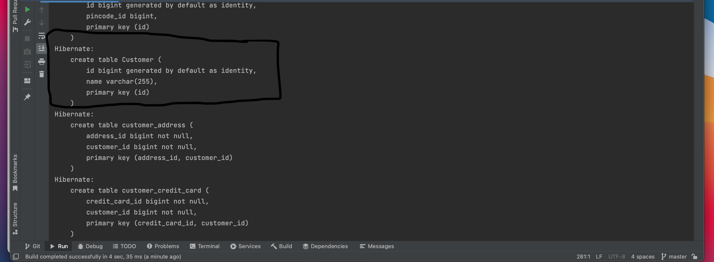

# DAT 250: Software Technology Experiment Assignment 2


## Experiment 1: JPA tutorial


## Experiment 2: Banking/Credit Card example JPA 
I implemented the domain model for credit cards, and persisted the objects into the database via the CreditCardsMain class. After doing this, I ran the CreditCardsMainTest class to make sure everyting was set up right. The Tests passed:


### Questions:
 1. In the persistence.xml file, it is specified that I am using a H2 database for this project. This is an in-memory database. This means that the database only exists in the memory while the application is running

 2.  To view the SQL used to create the table Customer, I simply went into the persistence.xml file and changed the following line:
```
<property name="hibernate.show_sql" value="false"/>
```
to 
```
<property name="hibernate.show_sql" value="true"/>
```


 3.  This was a part of the assignment that I was not able to do. But from the information I have found this would be the way to inspect the database, using H2 console:
Run the application and navigate to http://localhost:8080/h2-console in a browser. Fill in the following fields:
JDBC URL: jdbc:h2:mem:testdb
User Name: sa
Password: leave this part empty
Another way to inspect the database could be to download a database management system such as mySQL and connect to the database.
Some changes in the persistence.xml file might be needed.  

### Issues that I got stuck on:
 - Viewing the H2 database in an browser: I was unable to view the database in the browser. What I did to try to resolve it:
     - Changing the code for the H2-dependency in the pom.xml file
     - Changing the JDBC URL in the persistence.xml file

I used the sql that got logged to the console to see what tables that got created, and used prints to see the objects that got persisted into the tables. 


The project:
[assignment 2](https://github.com/vercel97/dat250-jpa-tutorial.git)
