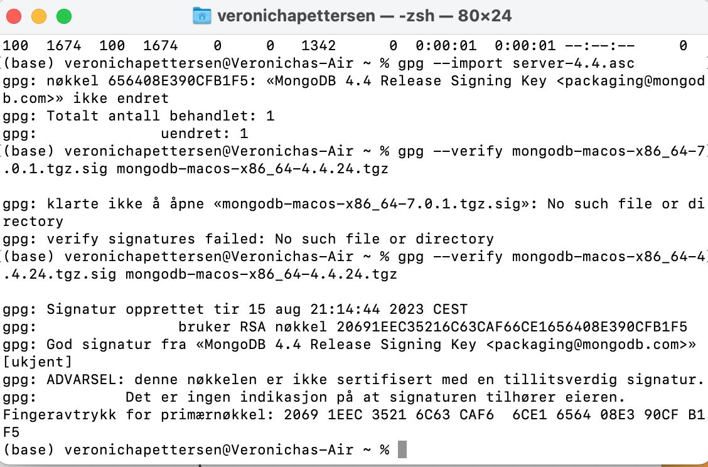

# Assignment 2 MongoDB

## Problems that I encountered
 - did not have GNUpg installed

## Validation for the installation of the package 
I followed the instructions provided when to validate the Mango package before installing it. 
I chose to validate the package using the provided PGP signature. I cose this method since it 
provides the strongest guarantees by checking both the integrity and the authenticity of the file. 
I downloaded the binaries for the 4.4.24 version of MongoDB. I found the files on the MongoDB Download Center. 
I then downloaded the public signature for the same version of MongoDB. I then Downloaded and imported the key file
as instructed, and lastly I verified the MongoDB installation file:

The english translation of the message retured is:
gpg: Signature made Wed Jun  5 03:17:20 2019 EDT
gpg:                using RSA key 4B7C549A058F8B6B
gpg: Good signature from "MongoDB 4.4 Release Signing Key <packaging@mongodb.com>" [unknown]

I also got the message:
gpg: WARNING: This key is not certified with a trusted signature!
gpg:          There is no indication that the signature belongs to the owner.
Primary key fingerprint: E162 F504 A20C DF15 827F  718D 4B7C 549A 058F 8B6B

It was mentioned in the instructions that this could happen becuse the signing key in my local trustdb is not 
trusted. Yet the package is in fact properly signed, so I assume that the downloaded package is valid and can be trustesd. 

## Experiment 1: MongoDB CRUD operations
In this part of the assignment, I followed the tutorials provided about CRUD operations. 

### Insert documents 

### Query documents

### Update documents

### Remove documents

### Bulk write operations

## Experiment 2: Aggregation

