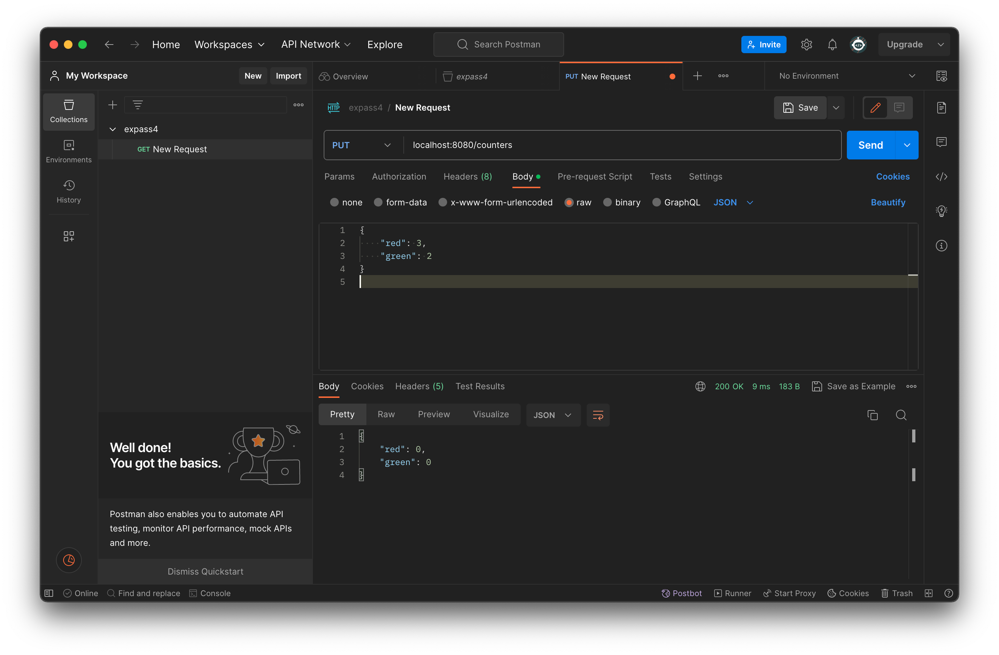
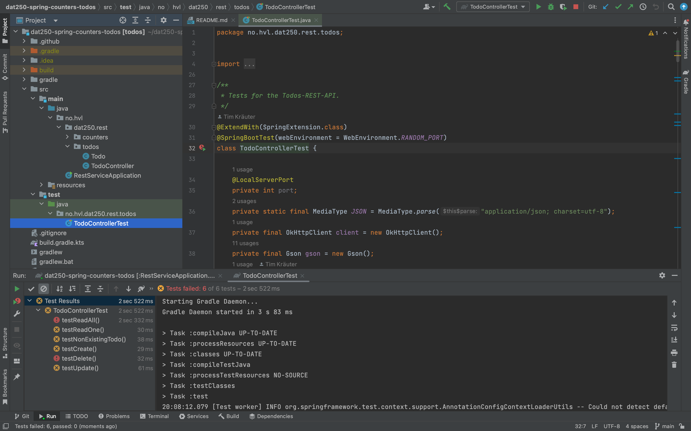
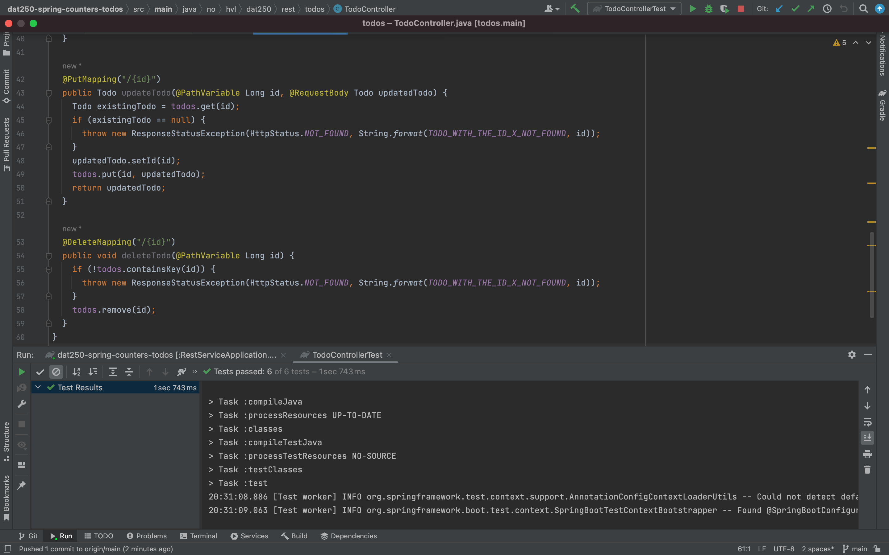

# DAT250: Software Technology Experiment Assignment 4

## Experiment 1: Spring project and Postman
I followed the instructions given in the assignment and forked the repository, cloned and imported it into my IDE. 
I then started the webserver by running the main class RestServiceApplication.java. 
I then installed Postman locally on my machine and tried to do some testing on the REST API. 
I first created a new collection in Postman, and then I created the HTTP requests, before executing them.

## Experiment 2: REST API for TODO-items
The following image is the result I got from running the test suite TodoControllerTest:

I implemented the REST API according to the spesifications, and ran the test again:

Here is the link to my code: https://github.com/vercel97/dat250-spring-counters-todos.git

