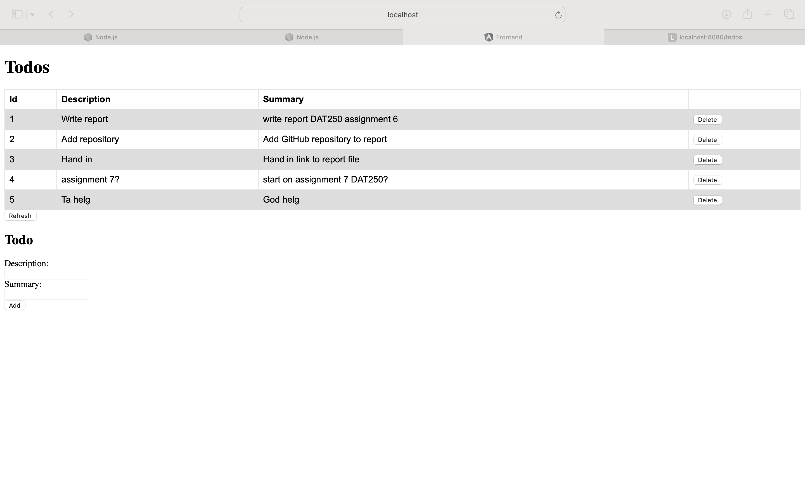
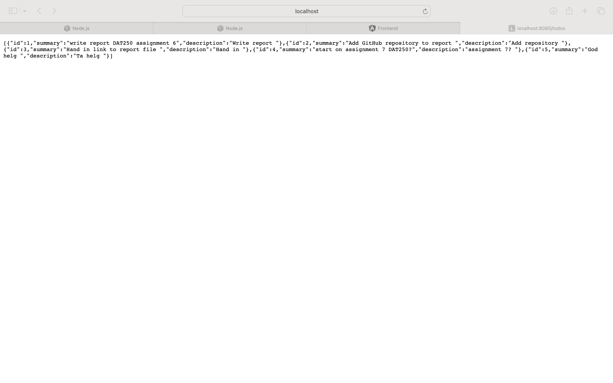
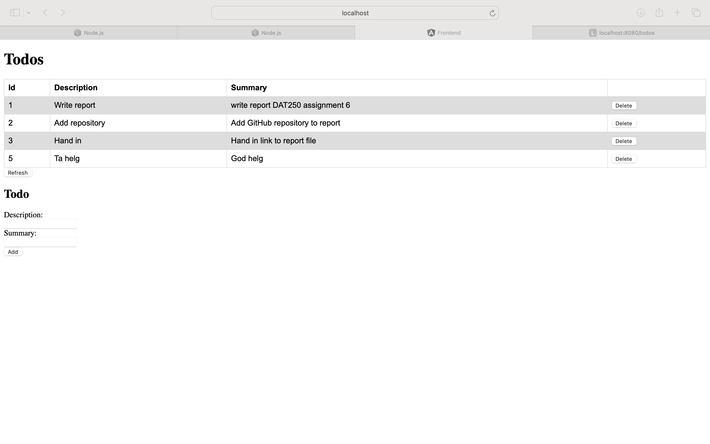
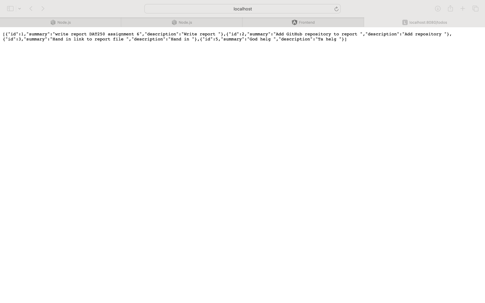

# DAT250: Software Technology Experiment Assignment 6 

# Experiment 1: Single-page applications
In this experiment, I decided to just continue building the angular front end in the same repsoitory
as the JPA backend. I do not think this is best practise, but since this is a pretty small project, I 
figured that is okey. For future experiments, I might want to keep the frontend and the backend 
seperate because of the readability of the strucutre of the project. 

I used the following [guide](https://www.baeldung.com/spring-boot-angular-web) to set up the angular frontend with the JPA backend

Here some todos are added:

Here one todo item is removed:

### Issues
 - CORS configurations
   - when I ran Angular, I got a CORS-error. This was because I had not added CORS configurations
     in the spring boot application, allowing requests from the Angular application (port 4200).
     Adding the CORS configuration solved the error.

Here is the code to my repository:

https://github.com/vercel97/dat250-spring-counters-todos.git

   
