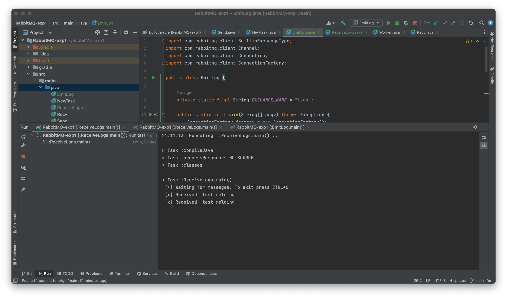

# DAT250: Software Technology Experiment Assignment 7

## Experiment 1: Installation

RabbitMQ was downloaded via Homebrew, following the following [tutorial](https://www.rabbitmq.com/install-homebrew.html)

## Experiment 2: Hello World
Here is the result from running the consumer:

Here is the result from running the consumer:

## Experiment 3: Work Queues
To run the classes in paralell, I edited the run configurations like so:

Here is the result from running 

## Eperiment 4: Topics

